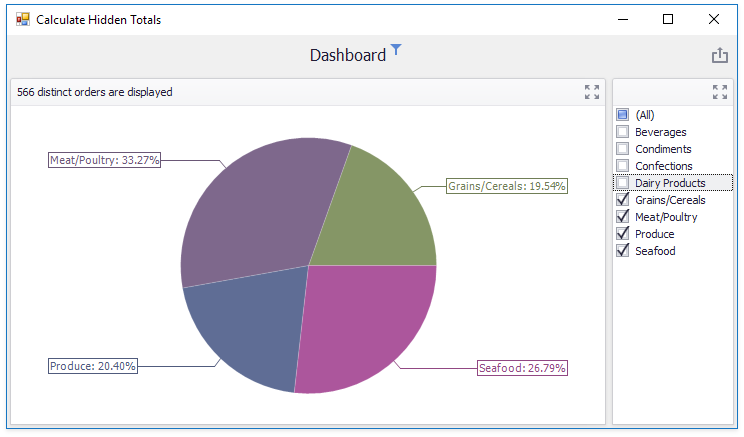

# How to Calculate and Display Totals for the Hidden Measure

This example demonstrates how to calculate a total value (distinct count) for a hidden measure and display it in the dashboard item's caption.

The [DashboardViewer.CalculateHiddenTotals](https://docs.devexpress.com/Dashboard/DevExpress.DashboardWin.DashboardViewer.CalculateHiddenTotals) property is set to **true** to calculate totals for a hidden _OrderID_ measure.

The [DashboardViewer.GetItemData](https://docs.devexpress.com/Dashboard/DevExpress.DashboardWin.DashboardViewer.GetItemData(System.String)) method retrieves the [MultiDimensionalData](https://docs.devexpress.com/Dashboard/DevExpress.DashboardCommon.ViewerData.MultiDimensionalData) object that contains the item's data. The [MultiDimensionalData.GetValue](https://docs.devexpress.com/Dashboard/DevExpress.DashboardCommon.ViewerData.MultiDimensionalData.GetValue(DevExpress.DashboardCommon.ViewerData.MeasureDescriptor)) method returns the totals value for the specified measure. The [DashboardViewer.CustomizeDashboardItemCaption](https://docs.devexpress.com/Dashboard/DevExpress.DashboardWin.DashboardViewer.CustomizeDashboardItemCaption) event is handled to display the value in the [PieDashboardItem](https://docs.devexpress.com/Dashboard/DevExpress.DashboardCommon.PieDashboardItem)'s caption.

API in this example:

* [DashboardViewer.CustomizeDashboardItemCaption](https://docs.devexpress.com/Dashboard/DevExpress.DashboardWin.DashboardViewer.CustomizeDashboardItemCaption) event
* [MultiDimensionalData](https://docs.devexpress.com/Dashboard/DevExpress.DashboardCommon.ViewerData.MultiDimensionalData) class
* [MultiDimensionalData.GetMeasures](https://docs.devexpress.com/Dashboard/DevExpress.DashboardCommon.ViewerData.MultiDimensionalData.GetMeasures) method
* [MultiDimensionalData.GetValue](https://docs.devexpress.com/Dashboard/DevExpress.DashboardCommon.ViewerData.MultiDimensionalData.GetValue(DevExpress.DashboardCommon.ViewerData.MeasureDescriptor)) method
* [DashboardViewer.CalculateHiddenTotals](https://docs.devexpress.com/Dashboard/DevExpress.DashboardWin.DashboardViewer.CalculateHiddenTotals) property
* [DashboardViewer.ConfigureDataConnection](https://docs.devexpress.com/Dashboard/DevExpress.DashboardWin.DashboardViewer.ConfigureDataConnection)
* [ExtractDataSourceConnectionParameters](https://docs.devexpress.com/Dashboard/DevExpress.DashboardCommon.ExtractDataSourceConnectionParameters) class

**See also:**

* [Extract Data Source](https://docs.devexpress.com/Dashboard/115900)
* [Obtaining Underlying and Displayed Data](https://docs.devexpress.com/Dashboard/17269)